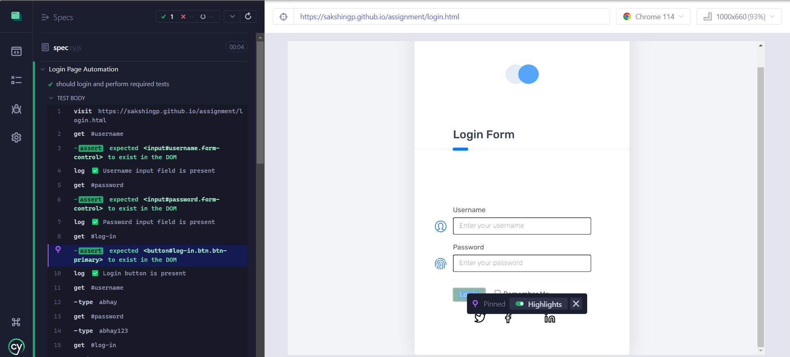
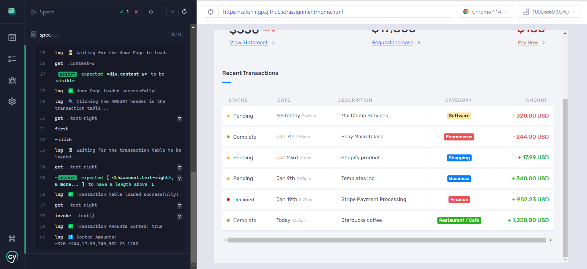
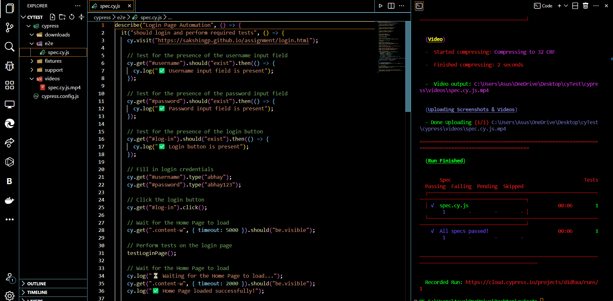
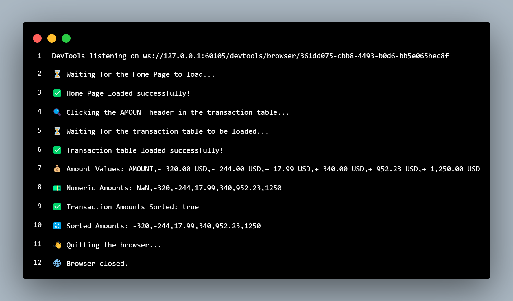

## Cypress E2E Setup with Node.js

This project uses Cypress for end-to-end (E2E) testing. Follow the steps below to set up and run the Cypress tests.

### Prerequisites

- Node.js should be installed on your machine.

### Installation

Install Cypress as a dev dependency using npm:

# npm install cypress --save-dev


### Project Setup

To set up the Cypress project, run the following command:

# npx cypress open

This will create the necessary Cypress files and open the Cypress Test Runner.


### Running Tests
To run the Cypress tests, you can use the following command:


### Cypress test
# Click img to see result
[](https://drive.google.com/file/d/1SMuff8j3EVy6pzTRpJG_n6CHyfqFLGFb/view?usp=sharing)

# run command
npx cypress run --record --key 1e404298-76fd-4194-9869-bc3cdec6776b

# Vs Code Img
]
### Running Tests
To run the Cypress tests, you can use the following command:


### selenium test


# Login Page Automation

> A Node.js script and Cypress code for automating the login process and validating transaction amounts on a web page.

## Description

This project provides two automation approaches for testing the login page and validating transaction amounts on a web page. 

The `LoginPageTest.js` script demonstrates how to automate the login process and perform validation using Selenium WebDriver in Node.js.

The `cypressLogin.spec.js` file contains the Cypress code for automating the login process and performing validation using Cypress.

Both approaches open a web page, enter login credentials, navigate to the home page, click on the "AMOUNT" header in the transaction table, retrieve the transaction amounts, and check if the amounts are sorted in ascending order.

## Prerequisites

- Node.js (v12 or higher) for running the `LoginPageTest.js` script.
- Chrome browser for running the `LoginPageTest.js` script.
- Cypress installed for running the Cypress code.

## Installation

### Node.js and Selenium WebDriver

1. Clone the repository:

   ```bash
   git clone https://github.com/Er-Abhay-FSD/LoginPageTest.git

## Prerequisites

- Node.js (v12 or higher)
- Chrome browser

### View the console output:

The script will log the progress and results of each step with proper emojis for clarity. The console output will display information such as the loading status of the home page, the click action on the "AMOUNT" header, the retrieval of transaction amounts, the sorting status of the amounts, and the sorted amounts.

Emojis Used
⏳ - Indicates a process is in progress.
✅ - Indicates a process is completed successfully.
🔍 - Indicates an action being performed.
💰 - Indicates the amount values retrieved.
💵 - Indicates the numeric amounts after parsing.
🔢 - Indicates the sorted amounts.
👋 - Indicates the script is quitting.
🌐 - Indicates the browser is closed.

### Writing Tests

Cypress tests can be written in JavaScript or TypeScript. Here's a basic example of a test:

```javascript
describe('My First Test', () => {
  it('Visits the home page', () => {
    cy.visit('/')
    cy.contains('Welcome to my website')
  })
})
